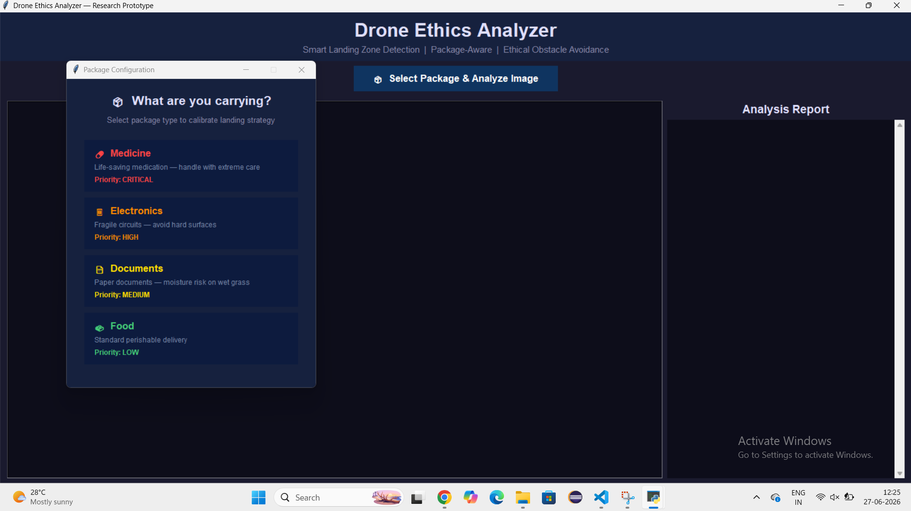
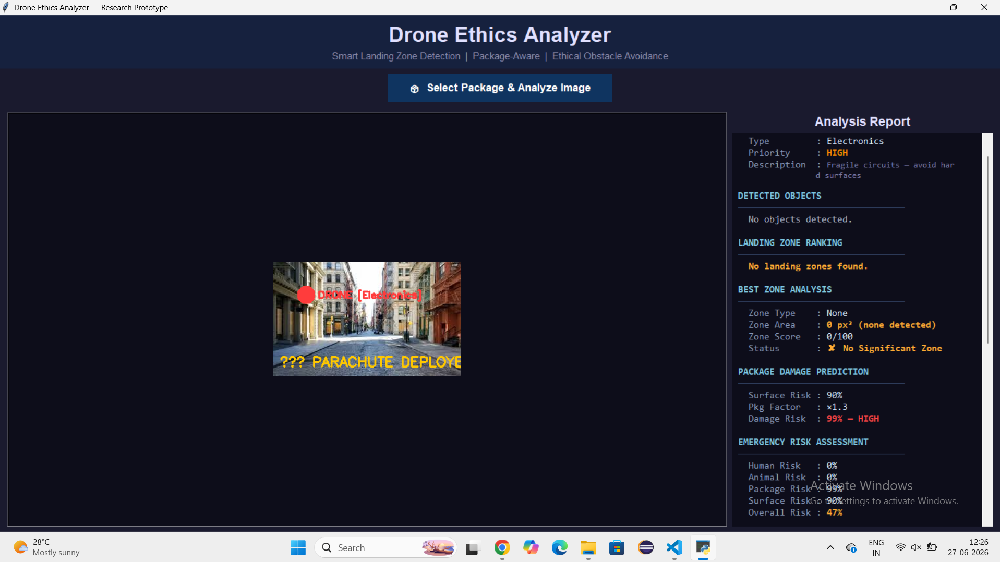
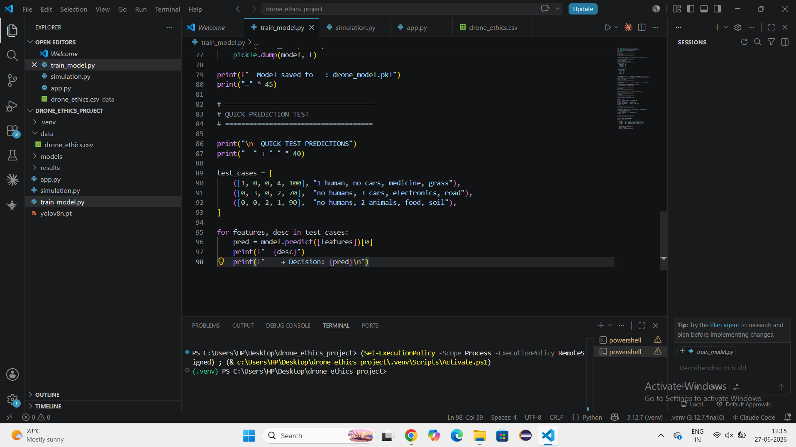

# Drone Ethics Project

## Overview
This project explores ethical decision-making in autonomous drone systems through scenario-based simulations.

## Features
- Ethical decision evaluation
- Scenario analysis
- Safety and privacy considerations
- Autonomous decision logic

## Technologies Used
- Python
- [Add any libraries you used]

## How to Run
1. Download or clone the repository
2. Install required dependencies
3. Run the main program

## Future Improvements
- Additional ethical scenarios
- Improved decision models
- Enhanced user interface
## Screenshots

### Image Analyzer


### Analysis Report


### Code Snapshot


## Technologies Used

- Python
- Tkinter
- OpenCV
- NumPy
- Pillow (PIL)

- ## How to Run

1. Clone the repository
2. Install dependencies
3. Run the application

```bash
pip install -r requirements.txt
python main.py


#### 4. Pin the repository
On the repository page, click **Pin** near the top.

Pinned repositories appear on your GitHub profile and are the first thing recruiters see.

---

One thing I noticed from your screenshots: the images are named **Analysis Report.png** and **Image analyzer.png**. Later, when you have time, rename them to:

- `analysis_report.png`
- `image_analyzer.png`

It looks more professional and avoids filename issues.

If you're using this project for internships, send me the current README content (or a screenshot of it), and I'll help you turn it into a polished portfolio README that looks recruiter-ready.

